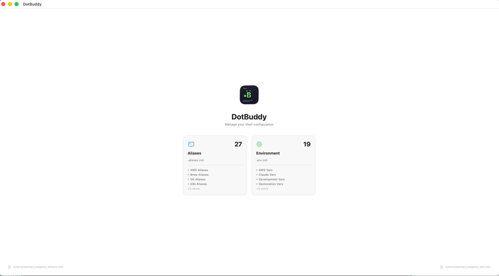
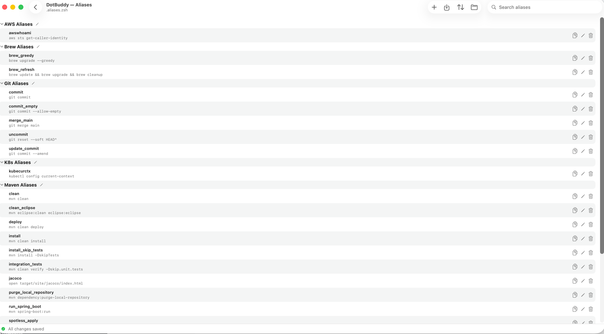
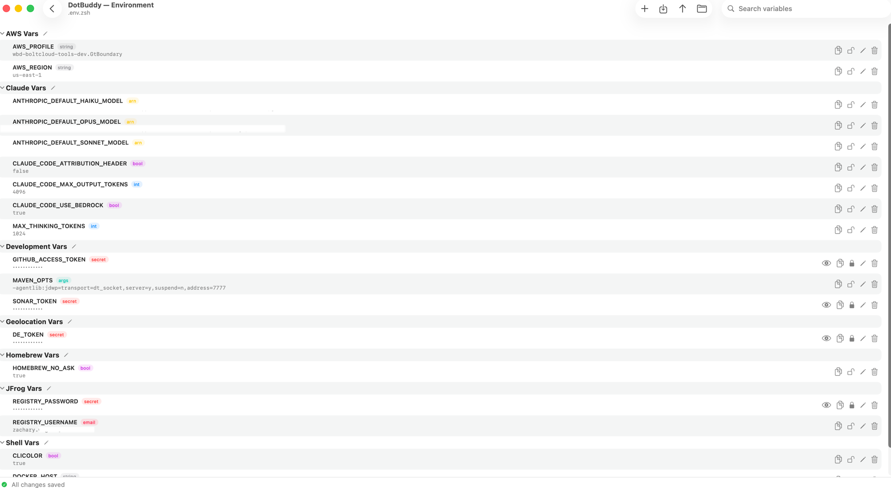

# DotBuddy

A macOS app for managing shell aliases and environment variables through a visual interface.

[](https://github.com/zackwag/DotBuddy/releases/latest)



## Features

### Aliases



- Add, edit, delete, and reorder shell aliases
- Group aliases with comment headers (written as `# Group Name` in the file)
- Rename, collapse/expand, and create new groups
- Sort alphabetically (groups and items within)
- Import aliases from any file
- Copy commands to clipboard

### Environment Variables



- Full CRUD for `export KEY="value"` entries
- Automatic type detection (bool, int, path, url, email, arn, uuid, args, secret)
- Mark variables as secret — values are hidden by default
- Touch ID required to reveal or copy secret values
- Secret flag persists in the file as a trailing `# [secret]` comment

### General
- Choose any dotfile or create defaults (`~/.aliases.zsh`, `~/.env.zsh`)
- Hidden files visible in the file picker
- Groups with collapsible disclosure
- Drag-to-reorder within groups
- Unsaved changes tracking with save/discard
- Quit confirmation when unsaved changes exist
- Sort order persists between sessions
- Post-save reminder to source the file (dismissible)
- Alternating row backgrounds
- Hover-reactive icon buttons

## Install

Download the latest release from the [Releases page](https://github.com/zackwag/DotBuddy/releases/latest). Unzip and drag `DotBuddy.app` to your Applications folder.

The app is signed and notarized — no Gatekeeper warnings.

## Requirements

- macOS 14.5+

## Setup

On first launch, select an existing aliases/env file or click "Create Default" to generate one.

Make sure your shell config sources the file:

```zsh
# In ~/.zshrc
source ~/.aliases.zsh
source ~/.env.zsh
```

## File Format

### Aliases
```zsh
# Git Aliases
alias commit='git commit'
alias uncommit='git reset --soft HEAD^'

# Brew Aliases
alias brew_refresh='brew update && brew upgrade && brew cleanup'
```

### Environment Variables
```zsh
# AWS Vars
export AWS_PROFILE="my-profile"
export AWS_REGION="us-east-1"

# Secrets
export GITHUB_ACCESS_TOKEN="ghp_xxxx" # [secret]
```

## Building from Source

1. Clone the repo
2. Open `DotBuddy.xcodeproj` in Xcode
3. Build and run

Requires Xcode 15.4+.

## License

MIT License. See [LICENSE](LICENSE) for details.
